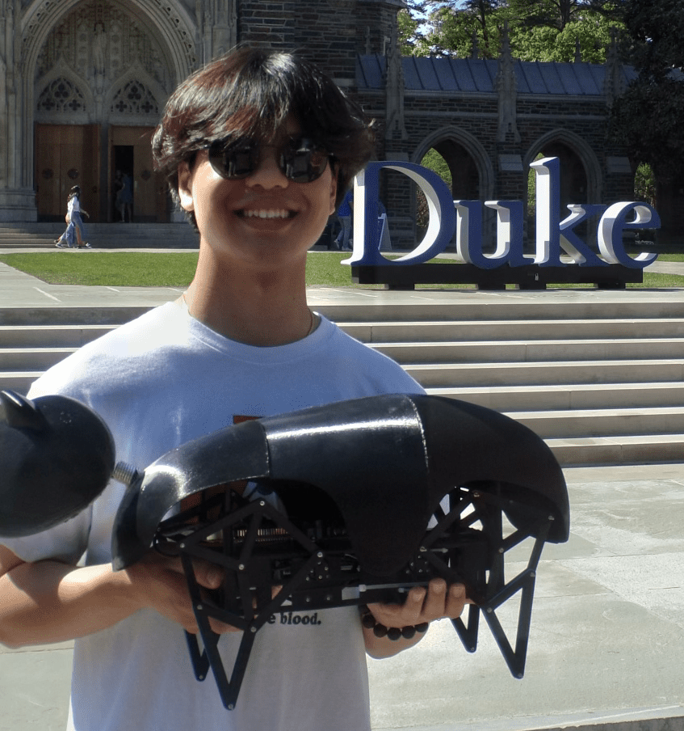
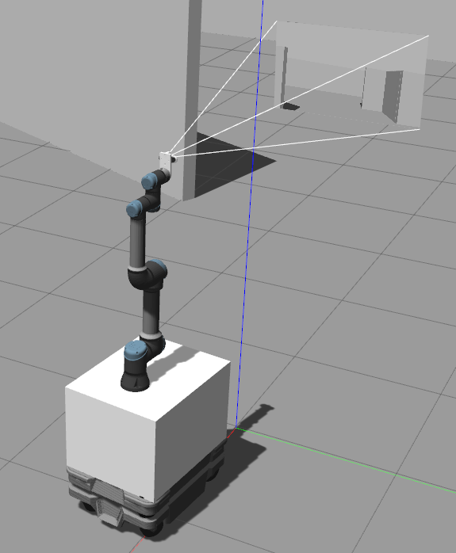

# Projects 

=== "Koda: The Walking Bear"

    {width="300"}

    **Koda** is a robotic quadruped that I independently designed and built from scratch with the goal of creating a **fully functional, organic-looking walking robot.** The design is inspired by Jansen linkages, which drive the robot’s locomotion without the need for complex joint actuation.

    Click [**here**](https://youtu.be/-_EiyzDHAsk) to watch my journey video!

    The primary challenge in this project was considering real-world manufacturing constraints beyond just the structural design, such as accounting for air ventilation for the microcontroller, part tolerances, and cable routing holes. If I were to redo this project again, I would reduce the size of the entire assembly and design a component stack that optimizes space within the robot. 

    This project pushed my ability to translate digital designs into physical, working systems, reinforcing the importance of tolerance considerations, real-world manufacturability, and iterative problem-solving.

=== "Cam 'n SLAM: Mobile Manipulator"

    {width="300"}

    **Cam 'n SLAM** involved **simulating a mobile manipulator** composed of a MiR 250 mobile base and UR5e robotic arm equipped with an Intel Realsense D435 Depth Camera. The goal was to develop a functional simulation environment using ROS2 and Gazebo, allowing for realistic physics-based interations where the robot could **navigate autonomously and perform manipulation tasks** within its surroundings.

    The primary focus was on integrating motion planning and obstacle avoidance to enable the manipulator to execute tasks efficiently while moving through its surroundings. I worked on **configuring URDF models** for compatiblity with the envrionment, **path planning using A* Algorithm**, and **arm kinematics** for manipulation tasks. Additionally, I implemented sensor-based navigation with **OpenCV**, allowing the robot to respond dynamically to its environment.

    For more information on this project, visit my dedicated [project site.](https://sites.google.com/view/ece383-team8-finalproject/home)
